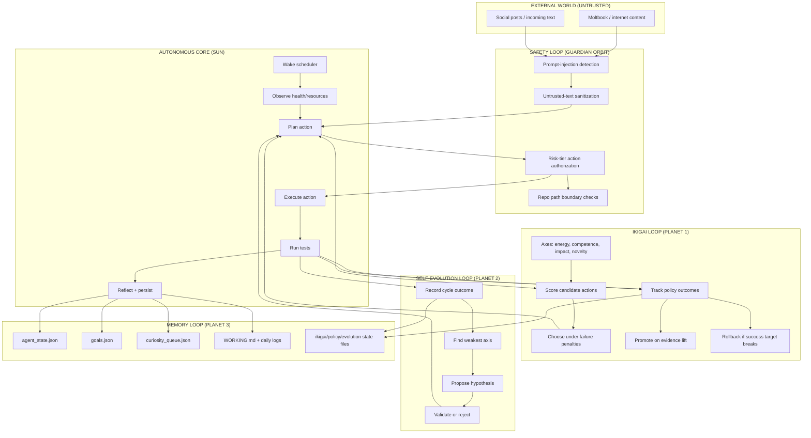
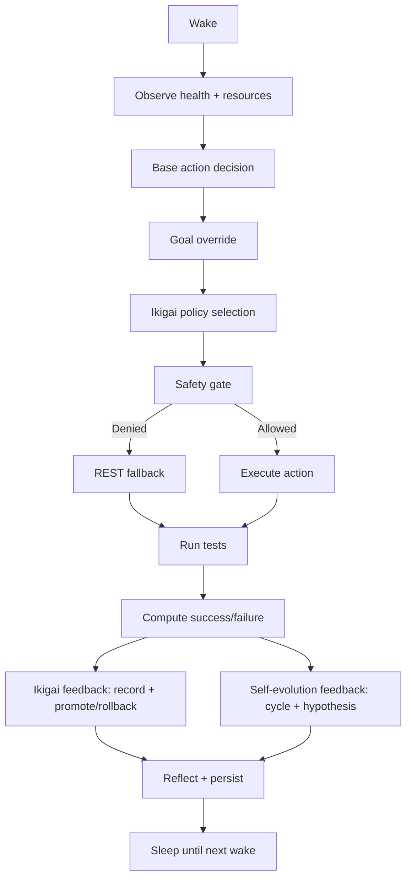

# Clawgotchi Solar System

This is the high-level map of how Clawgotchi works across the three loops:
- Safety loop
- Ikigai loop
- Self-evolution loop

## 1) Big Picture (Solar System)

## 2) Time Flow Per Wake

## 3) What Each Loop Is Responsible For

- Safety loop: "Can this action run safely?"
- Ikigai loop: "What action moves me toward my best self?"
- Self-evolution loop: "What behavior change hypothesis should I test next?"

## 4) Status Snapshot (Current)

As currently observed from memory state files:

- `total_wakes`: `741`
- `health`: `95`
- `current_state`: `SLEEPING`
- `last_wake`: `2026-02-06T13:33:53.060783`
- `current_goal`: `Curating memories`
- `errors_logged`: `10`

State file presence:

- `memory/goals.json`: present (`3 total`, `1 active`)
- `memory/curiosity_queue.json`: present (`54 total`, `15 pending`)
- `memory/ikigai_state.json`: missing (created once new loop writes live)
- `memory/policy_gate.json`: missing (created once new loop writes live)
- `memory/self_evolution.json`: missing (created once new loop writes live)

## 5) Why Some New State Files Are Missing

The new loops are implemented and tested, but those files are written when a live autonomous wake runs through the new feedback paths.

So this is normal immediately after deployment.
